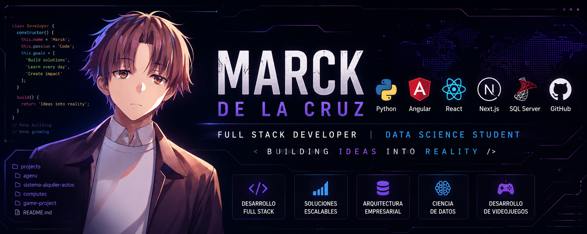

<div align="center">



# Marck De La Cruz

**Full Stack Developer · Data Science Student**

Me interesa crear software que resuelva problemas reales, desde sistemas empresariales hasta experiencias interactivas.

</div>

---

## Sobre mí

Soy estudiante de Ciencia de Datos y desarrollador Full Stack. Disfruto aprender construyendo proyectos que mezclen lógica, diseño y resolución de problemas.

Actualmente estoy enfocado en:

* Desarrollo de sistemas empresariales.
* Arquitectura y diseño de software.
* Ciencia de datos y análisis.
* Desarrollo de experiencias interactivas.

---

## Tecnologías

<div align="center">


</div>

---

## Proyectos destacados

### AGERU

Plataforma financiera empresarial orientada a la gestión eficiente y segura de operaciones.

**Tecnologías utilizadas:**

* Angular
* SQL Server
* APIs REST
* Arquitectura Empresarial

---

### Sistema de Reserva y Alquiler de Autos

Aplicación desarrollada en Python aplicando Programación Orientada a Objetos.

**Incluye:**

* Gestión de clientes
* Reservas y alquileres
* Administración de vehículos
* Reportes

---

### COMPUTEC

Sitio web para una tienda de computadoras.

**Características:**

* Catálogo de productos
* Equipos gamer y de oficina
* Laptops y accesorios

---

### Experiencias interactivas

Proyectos personales relacionados con videojuegos, sistemas interactivos y exploración de nuevas formas de contar historias mediante software.

---

## GitHub Stats

<div align="center">


</div>

---

## Actualmente aprendiendo

```text
Arquitectura Empresarial  ███████░░░
Ciencia de Datos          ██████░░░░
Next.js y React           ████████░░
Experiencias Interactivas █████░░░░░
```

---

## Contacto

📧 [marckdelacruzh@gmail.com](mailto:marckdelacruzh@gmail.com)

🐙 GitHub: https://github.com/MarckDL

💼 LinkedIn: Próximamente

---

<div align="center">

*"Learning by building."*

</div>
